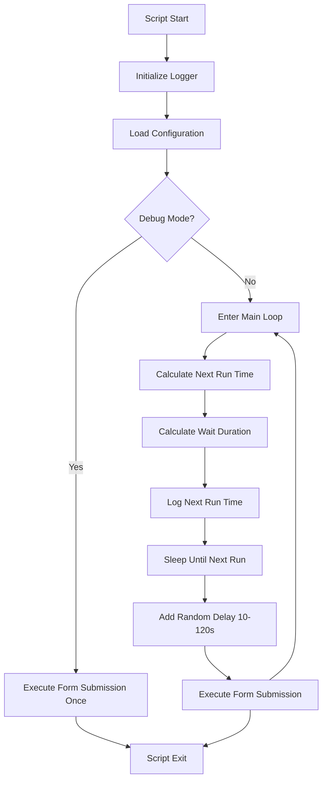
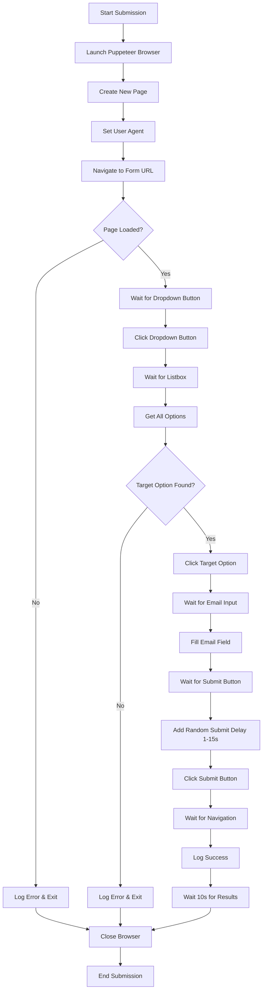

# formpuppet

A simple script in TypeScript, using Puppeteer to fill in a form and submit it on a fixed schedule.

## Overview

formpuppet is an automated form submission tool that uses Puppeteer to programmatically fill out and submit web forms at scheduled intervals. The script runs indefinitely, waiting for specified target hours to execute form submissions with randomized delays to avoid detection.

## Features

- **Automated Form Filling**: Uses Puppeteer to interact with web forms, filling dropdowns, text inputs, and clicking submit buttons
- **Scheduled Execution**: Runs form submissions at specific hours configured via environment variables
- **Randomized Delays**: Adds random delays before execution and between steps to appear more human-like
- **Headless/Browser Mode**: Can run in headless mode for production or with visible browser for debugging
- **Comprehensive Logging**: Logs all actions with timestamps to console and rotating log files
- **Error Handling**: Graceful error handling with detailed logging for troubleshooting
- **TypeScript**: Fully typed codebase for better development experience

## Architecture

The application consists of several modules:

- **main.ts**: Entry point that initializes logging and starts the scheduler
- **lib/scheduler.ts**: Handles timing calculations and the main execution loop
- **lib/formSubmission.ts**: Contains the Puppeteer logic for form automation
- **lib/logger.ts**: Manages logging to console and rotating log files
- **lib/config.ts**: Loads and validates environment configuration
- **lib/utils.ts**: Utility functions (currently just sleep function)

## How It Works

### Main Loop Flowchart



### Form Submission Process



## Configuration

Create a `.env` file based on `.env.example` with the following variables:

| Variable | Description | Example |
|----------|-------------|---------|
| `FORM_URL` | URL of the form to submit | `https://example.com/form` |
| `DROPDOWN_BUTTON_SELECTOR` | CSS selector for dropdown trigger | `div[role="button"]` |
| `LISTBOX_SELECTOR` | CSS selector for dropdown options container | `[role="listbox"]` |
| `OPTION_SELECTOR` | CSS selector for individual options | `[role="option"]` |
| `OPTION_TEXT` | Text content of the option to select | `John Doe` |
| `EMAIL_INPUT_SELECTOR` | CSS selector for email input field | `input[type="email"]` |
| `EMAIL` | Email address to fill in the form | `user@example.com` |
| `SUBMIT_BUTTON_SELECTOR` | CSS selector for submit button | `button[type="submit"]` |
| `TARGET_HOURS` | Comma-separated hours (0-23) for execution | `8,13,16` |
| `HEADLESS` | Run browser in headless mode | `true` |
| `DEBUG` | Run once immediately and exit | `false` |
| `MIN_DELAY_SECONDS` | Minimum random delay before execution (minutes) | `10` |
| `MAX_DELAY_SECONDS` | Maximum random delay before execution (minutes) | `120` |
| `MAX_SIZE` | Maximum log file size in bytes | `10485760` |
| `MAX_FILES` | Maximum number of log files to keep | `5` |
| `LOG_DIR` | Directory for log files | `logs` |

## Getting Started

### Prerequisites

- Node.js (v14 or higher)
- npm

### Installation

1. Clone the repository:
   ```bash
   git clone <repository-url>
   cd formpuppet
   ```

2. Install dependencies:
   ```bash
   npm install
   ```

3. Copy the environment example:
   ```bash
   cp .env.example .env
   ```

4. Configure your form details in `.env`

### Running the Script

#### Development/Debug Mode
```bash
# Run once immediately for testing
DEBUG=true npm run start
```

#### Production Mode
```bash
# Run scheduled submissions indefinitely
npm run start
```

#### Build and Run
```bash
npm run build
node dist/main.js
```

## Scheduling Logic

The script uses a sophisticated scheduling system:

1. **Target Hours**: Define specific hours when submissions should occur
2. **Next Run Calculation**: Finds the next target hour that hasn't passed today
3. **Wrap-around**: If all target hours have passed, schedules for the first hour tomorrow
4. **Random Delays**: Adds 10-120 minute random delay before each execution
5. **Submit Delays**: Adds 1-15 second random delay before clicking submit

Example: With `TARGET_HOURS=8,13,16` and current time 10:00:
- Next run: 13:00 + random delay (10-120 minutes)

## Browser Automation Details

The form submission process follows these steps:

1. **Browser Launch**: Starts Puppeteer with anti-detection flags
2. **Page Setup**: Creates new page with realistic user agent
3. **Navigation**: Loads form URL with network idle waiting
4. **Dropdown Interaction**:
   - Waits for dropdown button visibility
   - Clicks to open dropdown
   - Waits for options to load
   - Finds target option by text matching
   - Clicks the target option
5. **Form Filling**: Types email into input field
6. **Submission**: Waits for submit button, adds delay, then clicks
7. **Cleanup**: Waits 10 seconds to view results, then closes browser

## Logging

The script provides comprehensive logging:

- **Console Output**: Real-time logs with color-coded levels
- **File Logging**: Rotating log files in the `logs/` directory
- **Log Levels**: INFO, SUCCESS, WARN, ERROR, DEBUG, STACK
- **Timestamps**: All logs include Stockholm timezone timestamps
- **Rotation**: Automatic log rotation based on file size (default 10MB)

Log files are named: `form-script-YYYY-MM-DD.log`

## Error Handling

The script includes robust error handling:

- **Network Timeouts**: 60s page load, 30s navigation, 10s element waits
- **Element Not Found**: Detailed error messages for missing selectors
- **Browser Crashes**: Graceful browser cleanup on errors
- **Process Signals**: Proper cleanup on SIGINT/SIGTERM

## Development

### Available Scripts

- `npm run start`: Run the script with ts-node
- `npm run lint`: Lint TypeScript files with ESLint
- `npm run typecheck`: Run TypeScript type checking
- `npm run build`: Compile TypeScript to JavaScript

### Code Structure

```
formpuppet/
├── main.ts                 # Entry point
├── lib/
│   ├── scheduler.ts        # Scheduling logic
│   ├── formSubmission.ts   # Puppeteer automation
│   ├── logger.ts          # Logging system
│   ├── config.ts          # Configuration loading
│   └── utils.ts           # Utility functions
├── package.json
├── tsconfig.json
├── .env.example
└── README.md
```

## Troubleshooting

### Common Issues

1. **Element Not Found**: Update CSS selectors in `.env` - use browser dev tools to inspect elements
2. **Navigation Timeout**: Check FORM_URL and network connectivity
3. **Browser Launch Failed**: Ensure proper permissions for Puppeteer
4. **Scheduling Issues**: Verify TARGET_HOURS format and system timezone

### Debug Mode

Use `DEBUG=true` to run once immediately without scheduling for testing.

## Security Considerations

- Avoid logging sensitive information (passwords, API keys)
- Use environment variables for configuration
- Consider rate limiting and CAPTCHAs on target forms
- Respect website terms of service

## License

This project is licensed under the MIT License.</content>
<parameter name="filePath">S:\Documents\Code\formpuppet\README.md